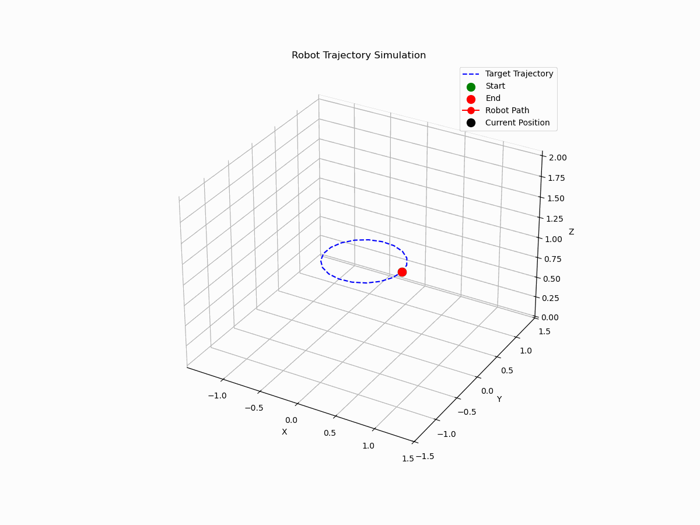
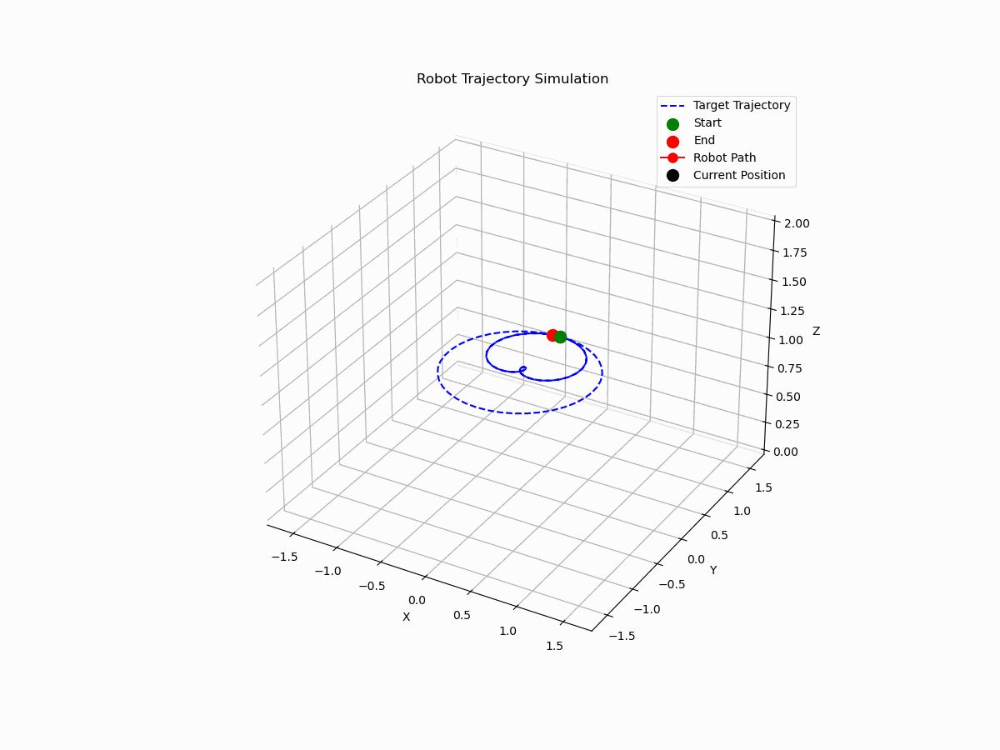

# RL CDPR

This work presents Reinforcement Learning algorithms for controlling the Cable-Driven Parallel Robot (4 cables, underconstrained). The work evaluates DDPG, PPO and TRPO algorithms on a simple robot model, providing a solid foundation for future research and experiments on a real cable-suspended robot.

## Robot model

CDPR has four cables attached to servomotors on a fixed $2.308m \times 2.808m$  frame, the anchor points are 3.22 meters high. Each cable is connected to the box-shaped end effector and a servomotor drum through the pulley. 

In the first approximation we considered the end effector as a point mass of 1 kg, drums and pulleys with zero inertia.

## CDPR Environment

The CDPR environment is a custom OpenAI Gym implementation, providing a standardized interface for reinforcement learning algorithms while encapsulating the dynamics of a 4-cable Cable-Driven Parallel Robot (CDPR) system, can be found in `/notebooks/robot_model.py`.

### Observation Space

- **Dimensions**: 12D (with target velocity) or 9D (without)
- **Components**: 
  - Current Position (3D)
  - Velocity (3D)
  - Target Position (3D)
  - *Optional* Desired Velocity (3D)
- **Bounds**: Defined by physical constraints, including workspace limits and maximum speed.

### Action Space

The action space consists of control inputs for the four cables, which can be:
- **Continuous**: Actions normalized between -1 and 1 (force applied).
- **Discrete**: Actions quantized into specified levels.

### Step Function

The step function simulates CDPR dynamics by:
- Taking an action and applying it to the system.
- Calculating the new state using a state-space formulation.
- Computing rewards based on:
  - Improvement in distance to the target
  - Proximity to the target
  - Optional velocity matching
- Checking termination conditions, such as reaching the target within 1 cm tolerance or exceeding the maximum number of steps.

### Reset Function

The reset function initializes a new episode by:
- Randomly sampling starting and target positions within workspace bounds.
- Setting initial velocity to zero.
- Constructing the observation state and resetting internal variables like the elapsed steps counter.


## Results

The table below provides results of RMS Error (m) for DDGP, PPO and TRPO algorithms for different trajectories:

| Trajectory      | DDPG | PPO | TRPO |
| :---        |    :----:   |   :----:   |         ---: |
| Circle      | 0.0098 | 0.0113 | 0.0075 |
| Spiral 1   | 0.0235 | 0.0125 | 0.0079 |
| Spiral 2   | 0.0114 | 0.0133 | 0.0084 |

The Trust Region Policy Optimization algorithm has shown best performance comparing to other algorithms. The TRPO trajectory traversals looks following:

Circle trajectory:


Spiral 1 trajectory:


Spiral 2 trajectory:



It can be seen that all algorithms move the end effector from point to point making "jumps". One can say that such behaviour is not energy efficient and that is true! This is not a final results, and research is ongoing.

## Navigation

Structure of the repository:
```bash
├── README.md
├── maths_behind_code # my notes about robot modeling and how RL algorithms work
├── mujoco_models # MuJoCo model of a CDPR
├── notebooks # Step-by-step study and research
│   ├── 01_state_space_modeling_simulation.ipynb
│   ├── 02_control.ipynb
│   ├── 03_RL_control.ipynb
│   ├── 04_RL_DDPGforCDPR.ipynb
│   ├── 05_RL_DQNdorCDPR.ipynb
│   ├── 06_RL_PPO.ipynb
│   ├── 07_RL_ActorCritic.ipynb
│   ├── 08_results_evaluation.ipynb
│   ├── 09_RL_ActorCritic_arbitrary_point.ipynb
│   ├── 10_StableBaselines3_PPO&DDPG.ipynb
│   ├── 11_SB3_PPO&DDPG&TRPO_evaluation.ipynb
│   ├── cdpr4_gifs # gifs after training process (point to point)
│   ├── models # Neural networks models
│   ├── robot_model.py # model of CDPR (env)
│   ├── visualizations # gifs of path traversing
├── reports # gifs and graphs from RL algorithm evaluations 
│   ├── gif
│   └── graph
└── requirements.txt
```

## Future works

- Try algorithms on a more complex robot-model: pulley and drums inertia should be included; end effector is not a point mass.
- Add cable stretching to model.
- Add energy consumtions to reward.